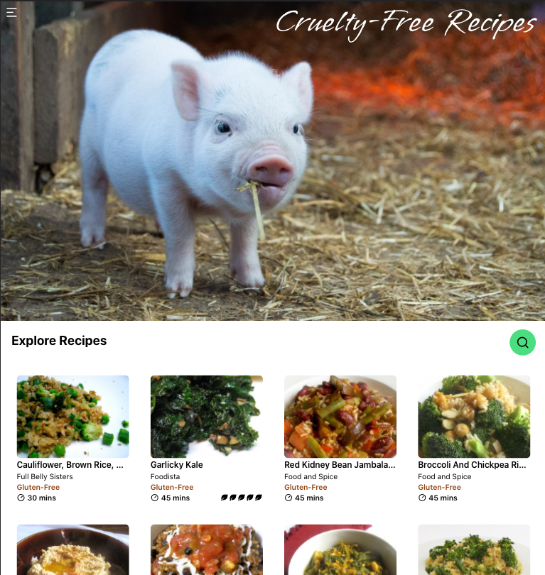

 

# Cruelty-Free Recipes

> Cruelty-Free Recipes is a plant-based recipe site.
>
>  <!-- If you have the project hosted somewhere, include the link here. -->

## Table of Contents

- [General Info](#general-information)
- [Technologies Used](#technologies-used)
- [Features](#features)
- [Screenshots](#screenshots)
- [Setup](#setup)
- [Usage](#usage)
- [Project Status](#project-status)
- [Room for Improvement](#room-for-improvement)
- [Contact](#contact)
<!-- * [License](#license) -->

## General Information

- I created Cruelty-Free Recipes because I wanted to incorporate more plant-based meals into my diet.
<!-- You don't have to answer all the questions - just the ones relevant to your project. -->

## Technologies Used

- React
- Ruby on Rails
- Postgres
- Active Record
- Action Mailer
- TailwindCSS

## Features

- Recipe search
- Ranking and commenting

## Screenshots

<!-- If you have screenshots you'd like to share, include them here. -->

## Setup

- Clone the repository to your local machine
- Open project in your editor
- Open terminal from editor or 'cd' to project directory and run:
  - bundle install
  - rails db:create db:migrate
  - rails s
- Open another terminal and run:
  - npm install --prefix client
  - npm start --prefix client

<!-- ## Project Status

Project is: _in progress_

## Room for Improvement

Room for improvement:

- Refactor code to be reuseable
- Find repeating code
- Fix sizing of elements on different screens

To do:

- Displaying previous workout weight
- Social media feature -->

## Contact

Created by [@vincentbaylon](https://www.linkedin.com/in/vincentbaylon) - feel free to contact me!
